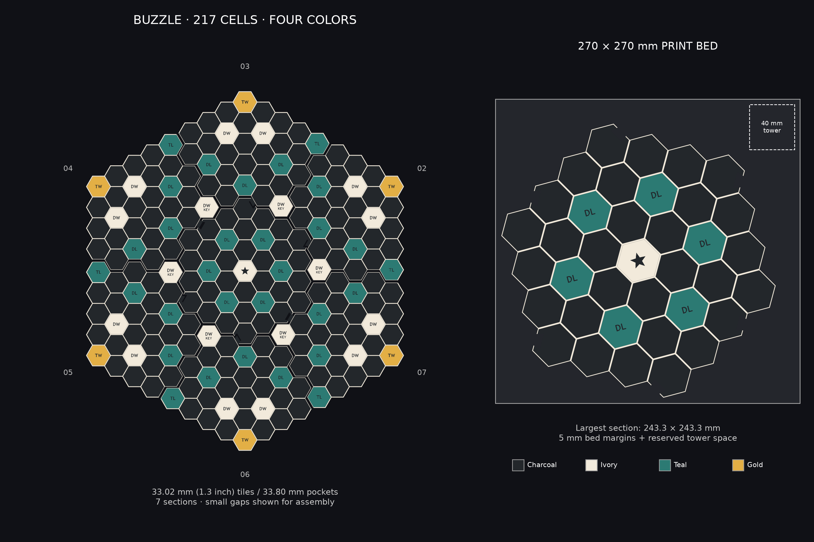

# BUZZLE board for existing 33.02 mm tiles

[Back to print library](../../README.md) · [Fit-test 3MF](plates/PRINT_FIRST_Pocket_and_Joint_Test.3mf)



This version fits **33.02 mm across-flats tiles without resizing the tiles**.
Pockets are **33.80 mm across flats**, giving 0.39 mm clearance per side.
All 217 cells and the approved scoring positions are preserved.

## Files to print

1. Print `plates/PRINT_FIRST_Pocket_and_Joint_Test.3mf`. Test an existing tile in both
   pockets and fit the two dovetail halves together. This uses the same pocket,
   wall, floor, and joint dimensions as the complete board.
2. Print **each of Plate_01 through Plate_07 once**, at **100% scale**.
   The hub has 37 cells; the six outer sections have 30 cells each.
3. Assemble flat on a table: center hub first, then lower the outer sections'
   dovetails into the matching hub sockets. Use the numbered preview to locate
   each sector; orient the text upright in the assembled board. Outer sections
   meet along their honeycomb edges. The joints align the board on the table;
   lift individual sections when moving it.

The assembled footprint is **529.8 × 599.8 mm**, with a 4 mm overall height,
2 mm pocket depth, and 2 mm floor. Individual sections fit a **270 × 270 mm bed** with at least 5 mm
of edge clearance and room for a **40 × 40 mm purge tower**. The center hub
is **243.3 × 243.3 mm** in its supplied orientation; outer sections are
at most **193.8 × 230.1 mm**, including their connectors. The exposed outer
rim is strengthened by an extra 0.7 mm; shared seams and pocket sizes are unchanged.

## Four-color setup

| Slot | Color | Parts |
|---|---|---|
| 1 | Charcoal | Foundation, plain pocket floors, labels, rib bodies |
| 2 | Ivory | Grid caps, DW, KEY, and start backgrounds |
| 3 | Teal | DL and TL backgrounds |
| 4 | Gold | TW backgrounds |

Load each 3MF as one assembly with aligned parts. Assign filaments by the
`[Slot N - Color]` part names if the slicer does not map embedded colors
automatically. Multiple parts reuse the same slot; there is no fifth filament.
The preview's white captions and gray section numbers are annotations.

Print **flat, pockets upward**, with a 0.20 mm layer height and 0.20 mm first
layer. Colored backgrounds occupy Z=1.2–2.0 mm and flush labels Z=1.6–2.0 mm.
Rib bodies occupy Z=2.0–3.6 mm in charcoal; their ivory caps occupy
Z=3.6–4.0 mm. The caps make every pocket easy to see and require only a
single-color final phase. Most of the board height needs one color at a time.
Do not flip this recessed board face-down using the tile instructions.

Models include at least 5 mm of bed-edge clearance and reserve space in the
upper-right corner for a purge tower. A **40 × 40 mm tower** fits at **X=225–265, Y=225–265**.
The tower itself is created by your slicer, not included in the 3MF. Keep the
supplied orientation and placement; a larger tower or automatic arrangement
needs a fresh clearance check. Check brim-to-tower spacing if you add a brim.

The dovetails have **0.20 mm nominal clearance** around the male profile. The
coupon is the physical check for your filament, extrusion calibration, and
first-layer expansion. Files have been checked for XML validity, closed mesh
solids, material separation, layout preservation, and bed clearance; they have
not been sliced or physically printed here.

## Regeneration

From the repository root with the CAD dependencies installed:

```powershell
python generate_board_270.py
python -m unittest test_board_270 -v
```

`print_manifest.json` records cell coordinates, dimensions, and placement
transforms for every section. `images/board_and_bed_preview.png` is drawn from the
same geometry used for the exports.

The historical files in `archive/legacy-outputs/` are not this repaired set.
The previously generated 38.1 mm tile / thirteen-section board variant was
removed after confirming that all game tiles should be 1.3 inches.

## Plate checklist

| File | Cells | Width × depth |
|---|---:|---:|
| [Plate_01_Center_Hub.3mf](plates/Plate_01_Center_Hub.3mf) | 37 | 243.3 × 243.3 mm |
| [Plate_02_Sector_000_060.3mf](plates/Plate_02_Sector_000_060.3mf) | 30 | 193.8 × 230.1 mm |
| [Plate_03_Sector_060_120.3mf](plates/Plate_03_Sector_060_120.3mf) | 30 | 193.8 × 229.5 mm |
| [Plate_04_Sector_120_180.3mf](plates/Plate_04_Sector_120_180.3mf) | 30 | 193.8 × 229.5 mm |
| [Plate_05_Sector_180_240.3mf](plates/Plate_05_Sector_180_240.3mf) | 30 | 193.8 × 229.5 mm |
| [Plate_06_Sector_240_300.3mf](plates/Plate_06_Sector_240_300.3mf) | 30 | 193.8 × 229.5 mm |
| [Plate_07_Sector_300_360.3mf](plates/Plate_07_Sector_300_360.3mf) | 30 | 193.8 × 229.5 mm |
