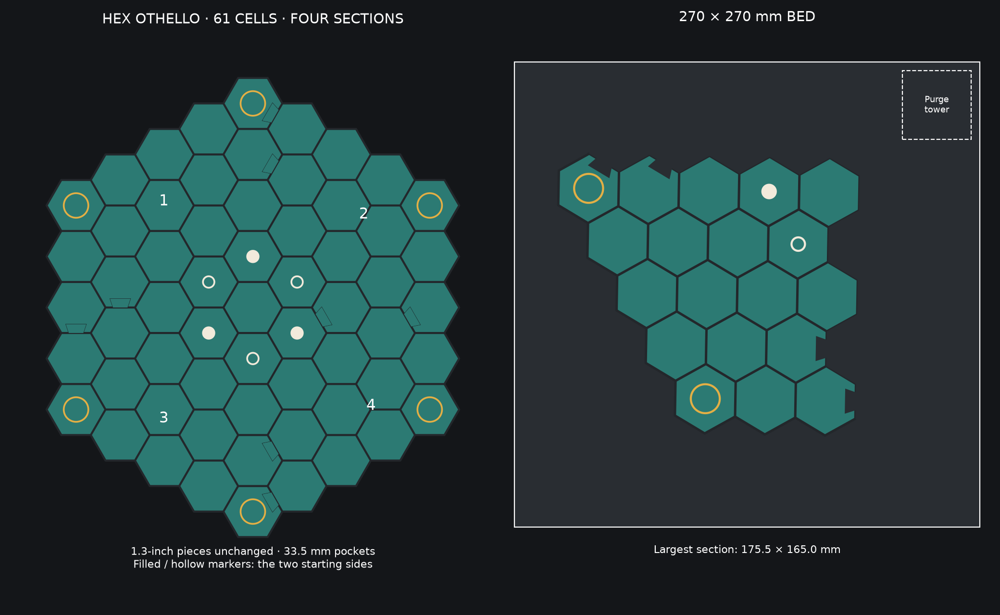

# Hex Othello board — 270 mm bed, 1.3-inch pieces

[Back to print library](../../README.md) · [Fit-test 3MF](plates/PRINT_FIRST_Pocket_and_Joint_Test.3mf)



Print **Plate_01 through Plate_04 once each at 100% scale**. This repaired set
keeps the 61-cell layout, 34.9 mm cell pitch, and existing **33.5 mm pockets**
for **33.02 mm (1.3-inch) reversible pieces**. No piece files were resized.

The board is **283.5 × 315.5 mm assembled**, including its stronger outer rim.
Its four sections fit comfortably on a 270 × 270 mm bed; the largest is
**175.5 × 165.0 mm**, including its dovetails. The board is 3.2 mm tall with
a 2.4 mm floor and shallow 0.8 mm recesses that leave the pieces easy to lift
and flip. Pocket clearance is 0.24 mm per side.

## Print and assemble

1. Print `plates/PRINT_FIRST_Pocket_and_Joint_Test.3mf` first. Test an existing piece
   and the mating dovetail halves before printing the board.
2. Load each numbered file as one assembly with its parts aligned. Assign
   filament by the named slots below; multiple parts reuse each slot.
3. Print flat with pockets facing upward at 0.20 mm layer height and a
   0.20 mm first layer. The geometry is built from flat layers and does not
   require support beneath the pockets or joints.
4. Assemble on a flat table in order: **01 top left, 02 top right, 03 bottom
   left, 04 bottom right**. Lower the dovetails vertically into their sockets.
   Their nominal clearance is 0.20 mm; the fit-test print checks your actual
   material and first-layer expansion. Move the board as separate sections.

The supplied placements leave at least 5 mm of bed-edge clearance and room
for a **40 × 40 mm purge tower at X=225–265, Y=225–265**. The slicer creates
the tower. Retain the supplied placement, or recheck clearance after using
automatic arrangement or adding a larger tower/brim.

## Same four filaments as BUZZLE

| Slot | Color | Parts |
|---|---|---|
| 1 | Charcoal | Frame, walls, structural base |
| 2 | Ivory | Starting markers and original underside ARES 23247 artwork |
| 3 | Teal | Pocket floors and flush joint tops |
| 4 | Gold | Six corner rings |

Ivory **filled circles** indicate the three ivory-side starting pieces;
ivory **hollow circles** indicate the three charcoal-side starting pieces.
The center remains empty in the illustrated six-piece opening. These markers
are flush and do not interfere with pieces. The six gold corner rings match
the six corner locations shown in the original board preview; the old mesh
had additional rings away from those corners.

Color changes are confined to the 0.8 mm underside inlay region and the
0.8 mm pocket-floor region. The middle layer and the final walls are charcoal.
The exposed perimeter has an extra 0.7 mm of material for a stronger rim.

## Validation and source

The four sections and fit test have been checked for closed, consistently
oriented mesh solids, valid 3MF XML, four-color assignments, non-overlapping
material volumes, pocket fit, mating-joint clearance, and bed/tower clearance.
They have **not been sliced or physically printed here**.

```powershell
python generate_othello_board_270.py
python -m unittest test_othello_board_270 -v
```

The generator reconstructs the structural geometry and reads the original
underside artwork from `assets/artwork/ares_23247_underside.geojson`. It no
longer depends on an archived master board file. Print the new files in this
folder rather than the archived quadrants.
`print_manifest.json` contains measured section sizes and placement transforms.
Numbers in the preview identify the sections and are not printed on the board.

## Plate checklist

| File | Cells | Width × depth |
|---|---:|---:|
| [Plate_01_Top_Left.3mf](plates/Plate_01_Top_Left.3mf) | 19 | 175.5 × 165.0 mm |
| [Plate_02_Top_Right.3mf](plates/Plate_02_Top_Right.3mf) | 14 | 154.2 × 153.7 mm |
| [Plate_03_Bottom_Left.3mf](plates/Plate_03_Bottom_Left.3mf) | 16 | 162.6 × 163.8 mm |
| [Plate_04_Bottom_Right.3mf](plates/Plate_04_Bottom_Right.3mf) | 12 | 140.6 × 136.9 mm |
