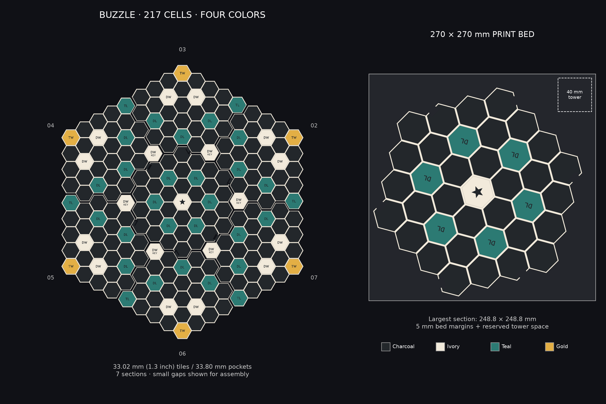
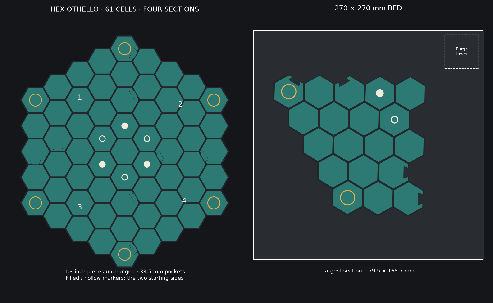
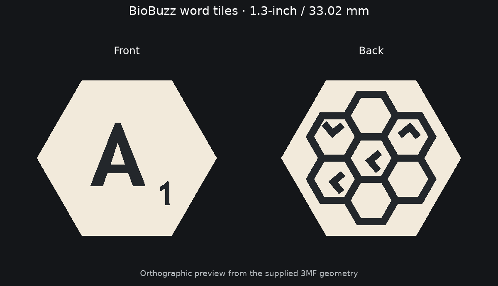
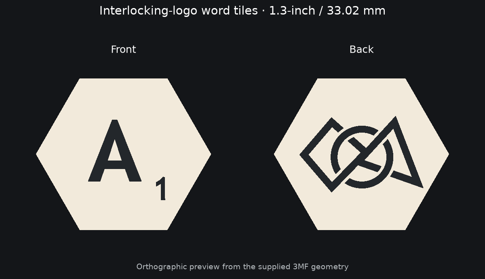
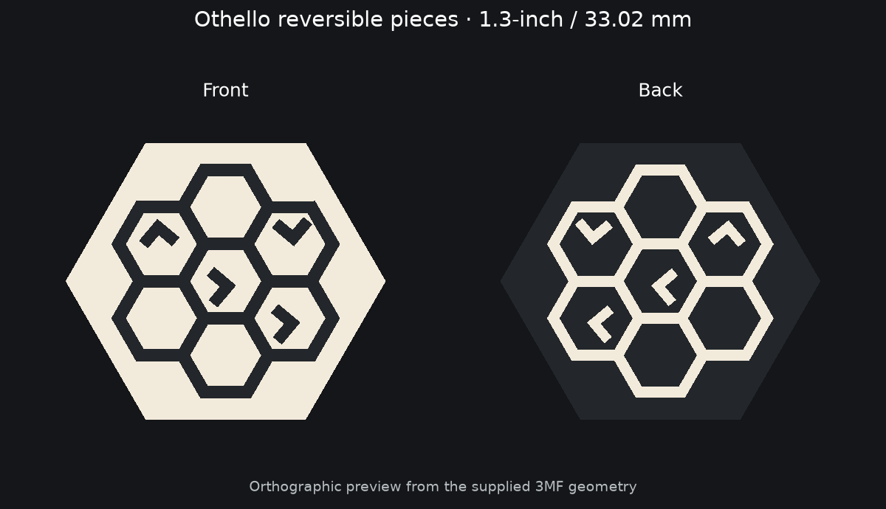

# Print library

**Start here. All current tiles are 1.3 inches / 33.02 mm across flats.**
Boards are arranged for a **270 × 270 mm bed** and use at most **four colors**.

Both boards now use the **v2_sturdy** design: **2.2 mm dividers**, **2.8 mm floors**,
and deeper pockets. BUZZLE is 5.8 mm tall with 3 mm pockets; Othello is 5.2 mm tall
with 2.4 mm pockets. Tile sizes are unchanged. Print a complete new set because
the wider cell spacing will not align with earlier board sections.

1. Choose a board below and read its print guide.
2. Print its small pocket-and-joint test first.
3. Print the numbered board plates at 100% scale, then choose a matching tile set.

## BUZZLE · 217 cells · 7 sections

[Print guide](boards/buzzle/PRINT_GUIDE.md) · [Fit-test 3MF](boards/buzzle/plates/PRINT_FIRST_Pocket_and_Joint_Test.3mf) · [Plates](boards/buzzle/plates/)

## Othello · 61 cells · 4 sections

[Print guide](boards/othello/PRINT_GUIDE.md) · [Fit-test 3MF](boards/othello/plates/PRINT_FIRST_Pocket_and_Joint_Test.3mf) · [Reversible pieces](tiles/othello/PRINT_GUIDE.md)

## Matching tile sets

| Set | Image | Guide |
|---|---|---|
| BioBuzz |  | [Files and quantities](tiles/biobuzz/PRINT_GUIDE.md) |
| Interlocking logo |  | [Files and quantities](tiles/interlocking/PRINT_GUIDE.md) |
| Team |  | [Files and quantities](tiles/team/PRINT_GUIDE.md) |
| Othello |  | [Files and quantities](tiles/othello/PRINT_GUIDE.md) |

## Accessories and reference

- [Seven-tile holders](accessories/tile-holders/PRINT_GUIDE.md)
- [Shared printing guide](../PRINTING_COLOR_GUIDE.md)
- [Development and regeneration](../docs/DEVELOPMENT.md)
- [Archived designs and old printouts](../archive/README.md)

Plain letter and Hive insect exports are not currently included: their obsolete
1.5-inch files were removed. Their generators now default to 33.02 mm; see the
development guide to generate fresh sets.

Every board folder contains `plates/`, `images/`, `PRINT_GUIDE.md`, and
`print_manifest.json`. Choose files from this library, not from the archive.
Board geometry/export checks pass; physical fit still needs the test print.
