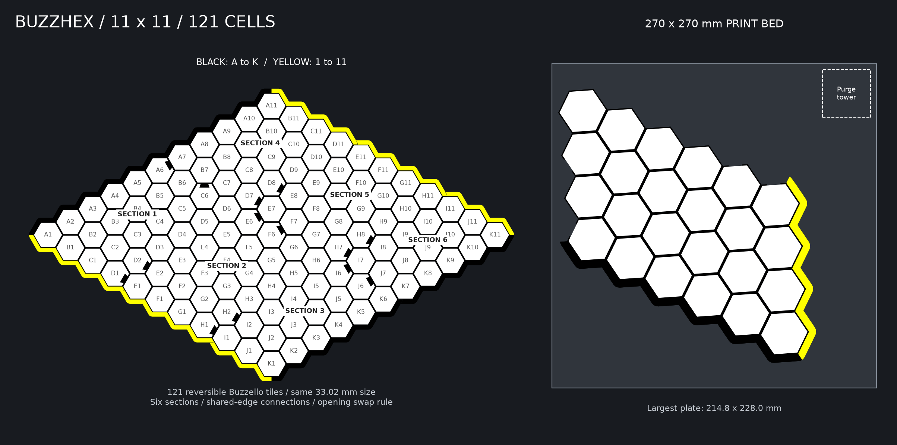

# Print library

**Start here. All current tiles are 1.3 inches / 33.02 mm across flats.**
Boards are arranged for a **270 × 270 mm bed** and use at most **four colors**.

**Colors:** yellow/black word tiles; black/yellow Othello board with black/yellow
pieces; black/white/blue/yellow BUZZLE board. The corrected 3MFs include surface
colors, named parts, and filament-slot assignments.
[Snapmaker and Printables import help](../docs/3MF_COLOR_IMPORT.md).

Both boards use sturdy dimensions: **2.2 mm dividers**, **2.8 mm floors**,
and deeper pockets. BUZZLE is 5.8 mm tall with 3 mm pockets; Othello is 5.2 mm tall
with 2.4 mm pockets. Tile sizes are unchanged. Print a complete new set because
the wider cell spacing will not align with earlier board sections.

Both boards retain **0.40 mm tab/socket clearance** and a
**0.30 mm seam gap** to reduce binding. Print its revised fit test first;
physical fit verification is pending.

1. Choose a board below and read its print guide.
2. Print its small pocket-and-joint test first.
3. Print the numbered board plates at 100% scale, then choose a matching tile set.

## BUZZLE · 217 cells · 7 sections

[Print guide](boards/buzzle/PRINT_GUIDE.md) · [Fit-test 3MF](boards/buzzle/plates/PRINT_FIRST_Pocket_and_Joint_Test.3mf) · [Plates](boards/buzzle/plates/)

## BUZZELLO · Classic and Large · 4 sections each

| Edition | Cells | Assembled size | Files |
|---|---:|---|---|
| Classic | 61 | 289.9 × 322.7 mm | [Guide and 3MFs](boards/othello-classic/PRINT_GUIDE.md) · [STLs](boards/othello-classic/stl/README.md) |
| Large | 91 | 351.8 × 394.1 mm | [Guide and 3MFs](boards/othello/PRINT_GUIDE.md) · [STLs](boards/othello/stl/README.md) |

[Print guide](boards/othello/PRINT_GUIDE.md) · [Fit-test 3MF](boards/othello/plates/PRINT_FIRST_Pocket_and_Joint_Test.3mf) · [Reversible pieces](tiles/othello/PRINT_GUIDE.md)

The v4 board adds a 30-cell outer ring around the original 61 cells. It uses
the same 1.3-inch pieces and four larger sections. Print all four as a matching
set. For 91 pieces, print the 30-piece batch three times plus one single.

## BUZZHEX · 11 × 11 Hex · 121 cells · 6 sections

[Print guide](boards/buzzhex/PRINT_GUIDE.md) · [Fit-test 3MF](boards/buzzhex/plates/PRINT_FIRST_Pocket_and_Joint_Test.3mf) · [Game rules](../docs/BUZZHEX_RULES.md) · [Website-agent prompt](../docs/BUZZHEX_WEBSITE_AGENT_PROMPT.md)

Uses the same 33.02 mm black/yellow reversible tiles as Buzzello. For a full
121-tile supply, print the existing 30-piece plate four times plus one single;
if you already have 60, add two 30-piece plates and one single. Board colors:
black/yellow goal rails and white pocket floors. Six sections retain 2.8 mm floors, 2.4 mm pockets,
0.40 mm socket clearance, and a 0.30 mm seam gap.

## Matching tile sets

| Set | Image | Guide |
|---|---|---|
| BioBuzz |  | [Files and quantities](tiles/biobuzz/PRINT_GUIDE.md) |
| Interlocking logo |  | [Files and quantities](tiles/interlocking/PRINT_GUIDE.md) |
| Team |  | [Files and quantities](tiles/team/PRINT_GUIDE.md) |
| Othello |  | [Files and quantities](tiles/othello/PRINT_GUIDE.md) |

## Accessories and reference

- [Seven-tile holders](accessories/tile-holders/PRINT_GUIDE.md)
- [Shared printing guide](../PRINTING_COLOR_GUIDE.md)
- [Development and regeneration](../docs/DEVELOPMENT.md)
- [Archived designs and old printouts](../archive/README.md)

Plain letter and Hive insect exports are not currently included: their obsolete
1.5-inch files were removed. Their generators now default to 33.02 mm; see the
development guide to generate fresh sets.

Every board folder contains `plates/`, `images/`, `PRINT_GUIDE.md`, and
`print_manifest.json`. Choose files from this library, not from the archive.
Board geometry/export checks pass; physical fit still needs the test print.
