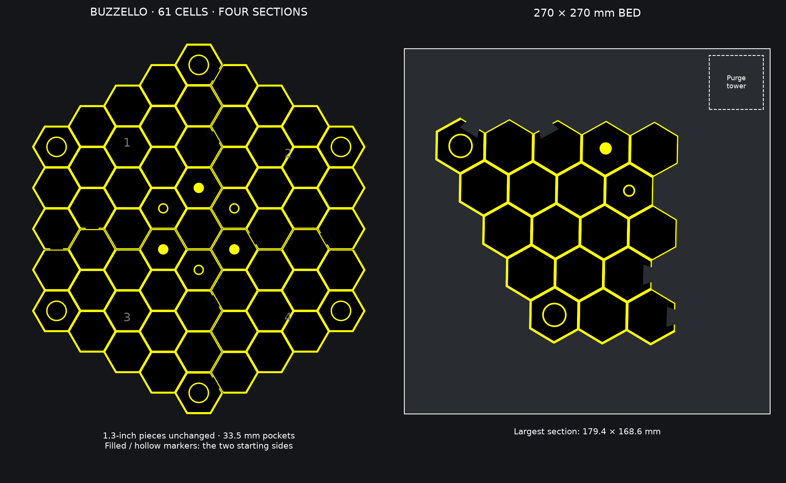
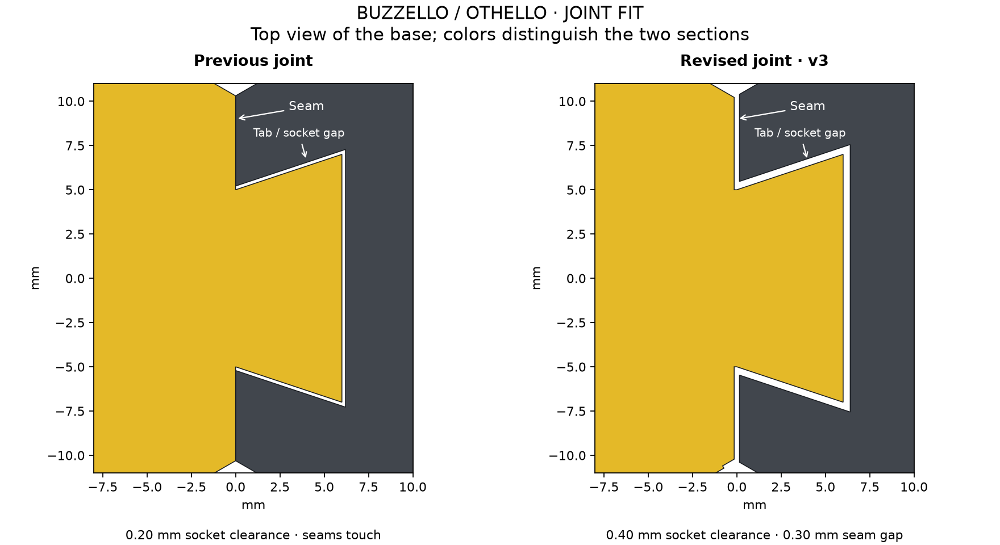
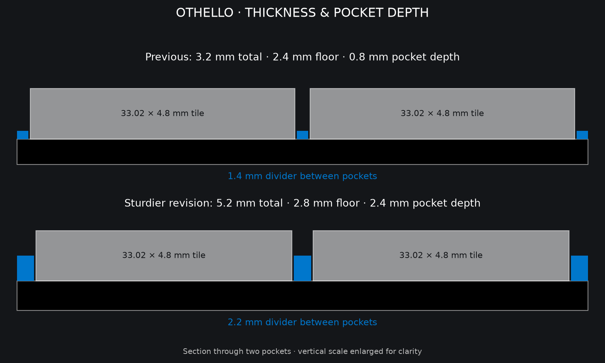

# BUZZELLO Classic — 61 cells, 270 mm bed

[Back to print library](../../README.md) · [Fit-test 3MF](plates/PRINT_FIRST_Pocket_and_Joint_Test.3mf)



Print **Plate_01 through Plate_04 once each at 100% scale**. This sturdier set
keeps the 61-cell layout and existing **33.5 mm pockets**
for **33.02 mm (1.3-inch) reversible pieces**. No piece files were resized.

**Revision v5_black_floors_yellow_dividers — September 6, 2026.** The sockets retain
**0.40 mm clearance around each tab** (previously 0.20 mm), and neighboring
sections have a **0.30 mm total seam gap** (previously their edges touched).
This removes nominal edge contact that can make assembled sections bind and lift.
The new joint fit has not yet been physically verified. Print the fit test first.



The sturdy dimensions are retained: dividers are **2.2 mm** wide
(previously 1.4 mm), the floor is **2.8 mm** thick (previously 2.4 mm), and pockets
are **2.4 mm** deep (previously 0.8 mm). Cell pitch increases from 34.9 to 35.7 mm.
Print a complete new set: the wider spacing will not align with earlier sections.
The [previous print set](../../../archive/printed-revisions/2026-09-05-before-thicker-boards/README.md)
is preserved for matching the board you already printed.



The board is **289.9 × 322.7 mm assembled**, including its stronger outer rim.
Its four sections fit comfortably on a 270 × 270 mm bed; the largest is
**179.4 × 168.6 mm**, including its dovetails. The board is 5.2 mm tall with
a 2.8 mm floor and 2.4 mm recesses. The 4.8 mm pieces extend 2.4 mm above
the dividers for lifting and flipping. Pocket clearance remains 0.24 mm per side.

## Choose your files

This Classic board has 61 cells. [Large has 91 cells](../othello/PRINT_GUIDE.md).
Both use the same 1.3-inch pieces. Print all four sections from one edition.
For a full Classic supply, print the 30-piece batch twice plus one single.

Use the 3MF files for embedded color assignments, or [download the STLs](stl/README.md).
STLs include a single-color version and aligned Black/Yellow parts. Load the two
color parts as one assembly and assign filaments manually.

## Print and assemble

1. Print `plates/PRINT_FIRST_Pocket_and_Joint_Test.3mf` first. Test an existing piece
   and the mating dovetail halves before printing the board. This pair uses the
   production socket and seam relief. Check that each half sits flat separately,
   then lower the tab into its socket on a flat table. Both undersides should
   remain on the table without forcing, rocking, or springing upward.
2. Load each numbered file as one assembly with its parts aligned. Assign
   filament by the named slots below; multiple parts reuse each slot.
3. Print flat with pockets facing upward at 0.20 mm layer height and a
   0.20 mm first layer. The geometry is built from flat layers and does not
   require support beneath the pockets or joints.
4. Assemble on a flat table in order: **01 top left, 02 top right, 03 bottom
   left, 04 bottom right**. Lower the dovetails vertically into their sockets.
   The socket offset is **0.40 mm per mating surface**, with **0.30 mm between
   section edges** (0.15 mm removed from each side). These are separate clearances;
   neither changes the tile pockets. Move the board as separate sections.

If the coupon binds, stop before printing the full set. Note whether the halves
are flat individually and whether contact is only at the bottom edge or along
the entire joint. A coupon checks local fit; after the full print, also check
all four sections together for flatness. Do not scale sections to adjust fit.

The supplied placements leave at least 5 mm of bed-edge clearance and room
for a **40 × 40 mm purge tower at X=225–265, Y=225–265**. The slicer creates
the tower. Retain the supplied placement, or recheck clearance after using
automatic arrangement or adding a larger tower/brim.

## Two-color setup: black and yellow

| Slot | Color | Parts |
|---|---|---|
| 1 | Black | Structural base, pocket floors and flush joint tops |
| 2 | Yellow | Raised hex dividers, starting markers, corner rings and underside artwork |

Yellow **filled circles** indicate the three yellow-side starting pieces;
yellow **hollow circles** indicate the three black-side starting pieces.
The center stays empty in the illustrated six-piece opening. The markers and
corner rings are flush. Reversible playing pieces are black and yellow.

Revision **v5_black_floors_yellow_dividers** keeps the foundation, pocket floors
and joint tops black. Yellow dividers extend from Z=2.0 to 5.2 mm: 3.2 mm of
yellow material, including the full 2.4 mm raised wall, rather than a thin yellow
pocket-floor overlay. Starting markers and corner rings remain flush yellow
inlays, and underside artwork remains yellow. Dimensions and joint fit are
unchanged from the preceding edition. The perimeter retains its extra 0.7 mm.

Read the [color import guide](../../../docs/3MF_COLOR_IMPORT.md) for the corrected
part labels, filament assignments, and Printables preview information.

## Validation and source

The four sections and fit test have been checked for closed, consistently
oriented mesh solids, valid 3MF XML, two-color assignments, non-overlapping
material volumes, pocket fit, mating-joint clearance, and bed/tower clearance.
They have **not been sliced or physically printed here**.

```powershell
python generate_othello_board_270.py --size classic
python -m unittest test_othello_board_270 -v
```

The generator reconstructs the structural geometry and reads the original
underside artwork from `assets/artwork/ares_23247_underside.geojson`. It no
longer depends on an archived master board file. Print the new files in this
folder rather than the archived quadrants.
`print_manifest.json` contains measured section sizes and placement transforms.
Numbers in the preview identify the sections and are not printed on the board.

## Plate checklist

| File | Cells | Width × depth |
|---|---:|---:|
| [Plate_01_Top_Left.3mf](plates/Plate_01_Top_Left.3mf) | 19 | 179.4 × 168.6 mm |
| [Plate_02_Top_Right.3mf](plates/Plate_02_Top_Right.3mf) | 14 | 157.6 × 157.0 mm |
| [Plate_03_Bottom_Left.3mf](plates/Plate_03_Bottom_Left.3mf) | 16 | 166.1 × 167.3 mm |
| [Plate_04_Bottom_Right.3mf](plates/Plate_04_Bottom_Right.3mf) | 12 | 138.2 × 143.6 mm |
