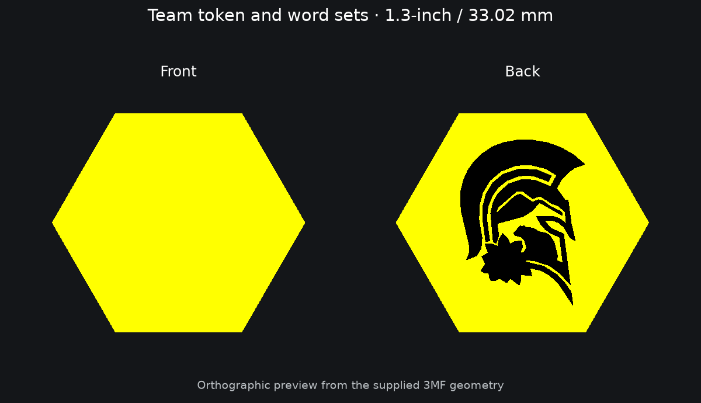

# Team token and word sets

**1.3 inches / 33.02 mm across flats. Print at 100% scale.**

The retained geometry is unchanged. Colors and explicit filament-slot labels
are now embedded in the 3MF files. Word tiles use yellow bodies with black
lettering/logos; Othello pieces use black and yellow.
Read the [color import guide](../../../docs/3MF_COLOR_IMPORT.md) before importing.

## Individual files

- [tile_team_spartan_token.3mf](3mf/tile_team_spartan_token.3mf)

## Batch plates

Choose one set: print each of the four **Scrabble** plates once for 100
tiles, or each of the six **Hive-Swarm** plates once for 144 tiles. The numbers
and math plate is a separate 26-tile collection. Do not print both word sets
unless you want both quantities. Files named `plate_256` retain their existing
layout; check placement and purge-tower space in your 270 mm slicer profile.

- [plate_256_team_hiveswarm_144set_plate1_of_6_24tiles.3mf](plates/plate_256_team_hiveswarm_144set_plate1_of_6_24tiles.3mf)
- [plate_256_team_hiveswarm_144set_plate2_of_6_24tiles.3mf](plates/plate_256_team_hiveswarm_144set_plate2_of_6_24tiles.3mf)
- [plate_256_team_hiveswarm_144set_plate3_of_6_24tiles.3mf](plates/plate_256_team_hiveswarm_144set_plate3_of_6_24tiles.3mf)
- [plate_256_team_hiveswarm_144set_plate4_of_6_24tiles.3mf](plates/plate_256_team_hiveswarm_144set_plate4_of_6_24tiles.3mf)
- [plate_256_team_hiveswarm_144set_plate5_of_6_24tiles.3mf](plates/plate_256_team_hiveswarm_144set_plate5_of_6_24tiles.3mf)
- [plate_256_team_hiveswarm_144set_plate6_of_6_24tiles.3mf](plates/plate_256_team_hiveswarm_144set_plate6_of_6_24tiles.3mf)
- [plate_256_team_numbers_and_math_26tiles.3mf](plates/plate_256_team_numbers_and_math_26tiles.3mf)
- [plate_256_team_scrabble_100set_plate1_of_4_25tiles.3mf](plates/plate_256_team_scrabble_100set_plate1_of_4_25tiles.3mf)
- [plate_256_team_scrabble_100set_plate2_of_4_25tiles.3mf](plates/plate_256_team_scrabble_100set_plate2_of_4_25tiles.3mf)
- [plate_256_team_scrabble_100set_plate3_of_4_25tiles.3mf](plates/plate_256_team_scrabble_100set_plate3_of_4_25tiles.3mf)
- [plate_256_team_scrabble_100set_plate4_of_4_25tiles.3mf](plates/plate_256_team_scrabble_100set_plate4_of_4_25tiles.3mf)

The tile exports were retained and organized; they have not been re-sliced or
physically validated in this cleanup. The preview is a top/bottom geometry view.
